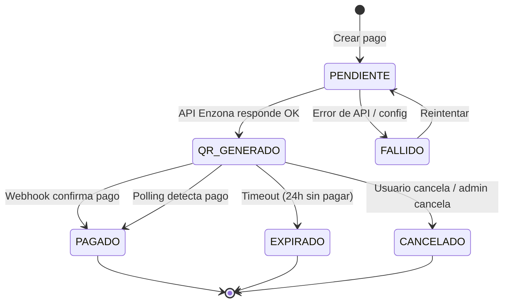

# Diseño de Integración de Pagos — Enzona QR API v1.0

> **Rama**: `developPaymentIntegratio`  
> **Fecha**: 2026-09-03  
> **API Externa**: Enzona QR v1.0 (`api.enzona.net/qr/v1.0.0`)  
> **Autenticación**: OAuth2 client_credentials (client_id + client_secret → Bearer token)

---

## 1. Visión General

Se integrará la pasarela de pagos de **Enzona** mediante generación de códigos QR para el cobro de suscripciones del sistema Fleet Management. Cuando una empresa necesite renovar o crear una suscripción, el sistema generará un QR de pago a través de la API de Enzona. El usuario escanea el QR con la app de Enzona, realiza el pago, y el sistema recibe la confirmación (vía webhook o polling) para activar la suscripción.

### API Externa — Endpoints Disponibles

| Método | Endpoint | Descripción |
|--------|----------|-------------|
| `POST` | `/qr/account` | Crear QR persona-a-persona. Retorna `vendor_identity_code` |
| `POST` | `/qr/merchant` | Crear QR de comercio. Retorna `vendor_identity_code` + `image` (base64 PNG) |
| `GET` | `/qr/{qr_code}` | Consultar info del QR (monto, moneda, estado) |
| `GET` | `/qr/payments/{qr_code}` | Consultar pagos asociados a un QR |

**Host**: `https://api.enzona.net`  
**Base Path**: `/qr/v1.0.0`  
**Token URL**: `https://api.enzona.net/token` (OAuth2 client_credentials)

---

## 2. Flujo de Estados del Pago



### Descripción de Estados

| Estado | Significado | Transiciones Salientes |
|--------|-------------|----------------------|
| `PENDIENTE` | Pago creado en BD, aún no se ha llamado a Enzona | → `QR_GENERADO`, → `FALLIDO` |
| `QR_GENERADO` | QR creado en Enzona, esperando que el usuario pague | → `PAGADO`, → `EXPIRADO`, → `CANCELADO` |
| `PAGADO` | Enzona confirmó el pago exitoso | Estado final |
| `FALLIDO` | Error al comunicarse con la API de Enzona | → `PENDIENTE` (reintento) |
| `EXPIRADO` | Pasaron 24h sin pago | Estado final |
| `CANCELADO` | Cancelado manualmente por el usuario o admin | Estado final |

---

## 3. Entidades Persistentes

### 3.1 `PaymentStatus` (Enum)

```
src/main/java/com/fleet/management/model/PaymentStatus.java
```

```java
public enum PaymentStatus {
    PENDIENTE,      // Creado en BD, sin llamar a Enzona
    QR_GENERADO,   // QR generado en Enzona, esperando pago
    PAGADO,        // Pago confirmado por Enzona
    FALLIDO,       // Error de comunicación con Enzona
    EXPIRADO,      // Timeout sin pago (24h)
    CANCELADO      // Cancelado manualmente
}
```

### 3.2 `PaymentType` (Enum)

```
src/main/java/com/fleet/management/model/PaymentType.java
```

```java
public enum PaymentType {
    NUEVA_SUSCRIPCION,   // Primer pago para activar suscripción
    RENOVACION,          // Renovación de suscripción existente
    UPGRADE              // Cambio a plan superior
}
```

### 3.3 `Payment` (Entity)

```
src/main/java/com/fleet/management/model/Payment.java
```

**Tabla**: `pay_payments`

| Columna | Tipo | Restricciones | Descripción |
|---------|------|---------------|-------------|
| `id` | BIGINT | PK, AUTO_INCREMENT | Heredado de BaseEntity |
| `activo` | BOOLEAN | NOT NULL, default true | Heredado de BaseEntity |
| `fecha_creacion` | TIMESTAMP | NOT NULL | Heredado de BaseEntity |
| `fecha_actualizacion` | TIMESTAMP | nullable | Heredado de BaseEntity |
| `creado_por_id` | BIGINT | FK → users | Heredado de BaseEntity |
| `modificado_por_id` | BIGINT | FK → users | Heredado de BaseEntity |
| `fk_payment_subscription` | BIGINT | FK → sub_subscriptions | Suscripción asociada |
| `fk_payment_empresa` | BIGINT | FK → empresas | Empresa que paga |
| `fk_payment_plan` | BIGINT | FK → sub_plans | Plan contratado |
| `amount` | DECIMAL(10,2) | NOT NULL | Monto a cobrar |
| `currency` | VARCHAR(10) | NOT NULL, default 'CUP' | Moneda (Enzona usa CUP) |
| `description` | VARCHAR(200) | nullable | Descripción del pago |
| `status` | VARCHAR(20) | NOT NULL | Enum PaymentStatus |
| `type` | VARCHAR(20) | NOT NULL | Enum PaymentType |
| `qr_code` | VARCHAR(100) | nullable, UNIQUE | `vendor_identity_code` de Enzona |
| `qr_image_base64` | TEXT | nullable | Imagen QR en base64 (de merchant) |
| `external_transaction_id` | VARCHAR(100) | nullable | ID de transacción de Enzona |
| `paid_at` | TIMESTAMP | nullable | Fecha/hora en que se confirmó el pago |
| `expires_at` | TIMESTAMP | NOT NULL | Fecha de expiración del QR |
| `error_message` | VARCHAR(500) | nullable | Mensaje de error si FALLIDO |
| `retry_count` | INT | default 0 | Número de reintentos de llamada a API |
| `version` | BIGINT | @Version | Control optimistic locking |

**Relaciones**:
- `subscription` → `@ManyToOne Subscription` (opcional, nullable para NUEVA_SUSCRIPCION)
- `empresa` → `@ManyToOne Empresa` (obligatorio)
- `plan` → `@ManyToOne Plan` (obligatorio)

### 3.3.1 Diagrama ER

```
┌─────────────────┐       ┌──────────────────┐
│    Empresa      │       │      Plan        │
├─────────────────┤       ├──────────────────┤
│ id (PK)         │◄──────│ id (PK)          │
│ codigo          │  1:N  │ nombre           │
│ nombre          │       │ precio_mensual   │
│ ...             │       │ duracion         │
└────────┬────────┘       └────────┬─────────┘
         │                         │
         │ 1:N                     │ 1:N
         │                         │
┌────────┴─────────────────────────┴─────────┐
│                 Payment                     │
├────────────────────────────────────────────┤
│ id (PK)                                     │
│ empresa_id (FK)                             │
│ plan_id (FK)                                │
│ subscription_id (FK, nullable)              │
│ amount                                      │
│ currency = 'CUP'                            │
│ status (PaymentStatus)                      │
│ type (PaymentType)                          │
│ qr_code (unique)                            │
│ qr_image_base64                             │
│ paid_at                                     │
│ expires_at                                  │
│ retry_count                                 │
│ error_message                               │
└────────────────────────────────────────────┘
```

---

## 4. Configuración de Aplicación

### 4.1 Propiedades en `application.properties`

```properties
# === Enzona QR Payment Gateway ===
enzona.client-id=${ENZONA_CLIENT_ID:}
enzona.client-secret=${ENZONA_CLIENT_SECRET:}
enzona.merchant-uuid=${ENZONA_MERCHANT_UUID:}
enzona.base-url=https://api.enzona.net
enzona.token-url=https://api.enzona.net/token
enzona.qr-base-path=/qr/v1.0.0
enzona.currency=CUP
enzona.qr-timeout-hours=24
enzona.notify-url=${ENZONA_NOTIFY_URL:https://fleet.midominio.cu/api/payments/webhook/enzona}
enzona.return-url=${ENZONA_RETURN_URL:https://fleet.midominio.cu/payment/return}
```

### 4.2 Variables de entorno requeridas

| Variable | Descripción | Ejemplo |
|----------|-------------|---------|
| `ENZONA_CLIENT_ID` | Client ID de la aplicación en Enzona | `abc123...` |
| `ENZONA_CLIENT_SECRET` | Client Secret de la aplicación en Enzona | `xyz789...` |
| `ENZONA_MERCHANT_UUID` | UUID del comercio registrado en Enzona | `550e8400-e29b-41d4-a716-446655440000` |
| `ENZONA_NOTIFY_URL` | URL pública para recibir webhooks de Enzona | `https://...` |

---

## 5. Componentes a Implementar

### 5.1 Estructura de Paquetes

```
com.fleet.management/
├── config/
│   └── PaymentConfig.java              // @ConfigurationProperties para Enzona
├── model/
│   ├── Payment.java                    // Entidad persistente
│   ├── PaymentStatus.java              // Enum de estados
│   └── PaymentType.java                // Enum de tipos de pago
├── dto/
│   └── payment/
│       ├── PaymentResponse.java        // DTO de respuesta completa
│       ├── PaymentCreateRequest.java   // DTO para crear pago
│       ├── PaymentQrResponse.java      // DTO con QR para el frontend
│       └── PaymentNotificationDto.java // DTO para recibir webhook
├── repository/
│   └── PaymentRepository.java          // JpaRepository + queries custom
├── client/
│   └── enzona/
│       ├── EnzonaQrClient.java         // Interface del cliente REST
│       ├── EnzonaQrClientImpl.java     // Implementación con RestTemplate/WebClient
│       ├── dto/
│       │   ├── EnzonaTokenRequest.java
│       │   ├── EnzonaTokenResponse.java
│       │   ├── EnzonaQrMerchantRequest.java
│       │   ├── EnzonaQrMerchantResponse.java
│       │   └── EnzonaQrInfoResponse.java
│       └── EnzonaAuthInterceptor.java  // Interceptor para inyectar Bearer token
├── service/
│   ├── PaymentService.java             // Interface del servicio
│   └── impl/
│       └── PaymentServiceImpl.java     // Lógica de negocio
├── controller/
│   └── PaymentController.java          // Endpoints REST
└── scheduler/
    └── PaymentExpirationScheduler.java // Job para expirar QRs y hacer polling
```

---

## 6. Endpoints a Implementar

### 6.1 Controller: `PaymentController`
**Base path**: `/api/payments`

#### `POST /api/payments`
**Descripción**: Crear un nuevo pago y generar el QR con Enzona.

**Request Body**:
```json
{
  "planId": 1,
  "type": "NUEVA_SUSCRIPCION",
  "subscriptionId": null
}
```

| Campo | Tipo | Obligatorio | Descripción |
|-------|------|-------------|-------------|
| `planId` | Long | Sí | Plan a contratar/renovar |
| `type` | PaymentType | Sí | NUEVA_SUSCRIPCION, RENOVACION, UPGRADE |
| `subscriptionId` | Long | No | Suscripción existente (para renovaciones) |

**Response** `201 Created`:
```json
{
  "id": 1,
  "empresa": { "id": 1, "codigo": "EMP001", "nombre": "Transporte X" },
  "plan": { "id": 1, "nombre": "Básico", "precioMensual": 500.00 },
  "amount": 500.00,
  "currency": "CUP",
  "status": "QR_GENERADO",
  "type": "NUEVA_SUSCRIPCION",
  "qrCode": "078b46087c11ec4ee282dd243814063c1d",
  "qrImageBase64": "iVBORw0KGgo...",
  "expiresAt": "2026-09-04T14:30:00",
  "fechaCreacion": "2026-09-03T14:30:00"
}
```

**Lógica interna**:
1. Resolver `empresaId` via `SecurityUtils.resolveEmpresaId()`
2. Validar que no exista un pago `QR_GENERADO` o `PENDIENTE` activo para la misma empresa y tipo
3. Calcular `amount` del `plan.precioMensual`
4. Crear `Payment` en estado `PENDIENTE`
5. Llamar a `EnzonaQrClient.crearQrMerchant(amount, description)`
6. Actualizar `Payment` con `qr_code`, `qr_image_base64`, `expires_at`, status → `QR_GENERADO`
7. Retornar `PaymentQrResponse`

---

#### `GET /api/payments/{id}`
**Descripción**: Obtener detalle de un pago por ID.

**Response** `200 OK`:
```json
{
  "id": 1,
  "empresa": { ... },
  "plan": { ... },
  "amount": 500.00,
  "currency": "CUP",
  "status": "QR_GENERADO",
  "type": "NUEVA_SUSCRIPCION",
  "qrCode": "078b46087c11ec4ee282dd243814063c1d",
  "qrImageBase64": "iVBORw0KGgo...",
  "externalTransactionId": null,
  "paidAt": null,
  "expiresAt": "2026-09-04T14:30:00",
  "errorMessage": null,
  "retryCount": 0,
  "fechaCreacion": "2026-09-03T14:30:00",
  "fechaActualizacion": "2026-09-03T14:30:00"
}
```

---

#### `GET /api/payments/my-company`
**Descripción**: Obtener el pago activo (QR_GENERADO o PENDIENTE) de la empresa del usuario autenticado.

**Response** `200 OK`: Igual que `GET /{id}`, o `404` si no hay pago activo.

---

#### `GET /api/payments/empresa/{empresaId}`
**Descripción**: Listar pagos de una empresa con paginación.

**Query params**: `page`, `perPage`, `sort`, `sortOrder`, `status` (filtro opcional)

---

#### `POST /api/payments/{id}/cancel`
**Descripción**: Cancelar un pago en estado `QR_GENERADO` o `PENDIENTE`.

**Precondiciones**:
- Solo el admin de la empresa o un usuario con rol ADMIN puede cancelar
- El pago debe estar en estado `QR_GENERADO` o `PENDIENTE`

**Response** `200 OK` con el pago actualizado (status → `CANCELADO`).

---

#### `POST /api/payments/{id}/retry`
**Descripción**: Reintentar la generación del QR para un pago en estado `FALLIDO`.

**Lógica**:
1. Validar estado = `FALLIDO`
2. Validar `retryCount < 3`
3. Incrementar `retry_count`
4. Re-ejecutar la llamada a Enzona

**Response** `200 OK` con el pago actualizado.

---

#### `POST /api/payments/webhook/enzona`
**Descripción**: Webhook que recibe notificaciones de Enzona cuando un pago es completado.

**Importante**: Este endpoint debe ser público (sin autenticación JWT) pero con validación de firma o IP de origen.

**Request Body** (según notificación de Enzona):
```json
{
  "qr_code": "078b46087c11ec4ee282dd243814063c1d",
  "transaction_id": "txn_abc123",
  "status": "completed",
  "amount": "500.00",
  "currency": "CUP",
  "timestamp": "2026-09-03T15:00:00Z"
}
```

**Lógica interna**:
1. Buscar `Payment` por `qr_code`
2. Validar monto y moneda coincidan
3. Actualizar: `status → PAGADO`, `paid_at`, `external_transaction_id`
4. Ejecutar acción post-pago según `type`:
   - **NUEVA_SUSCRIPCION**: Crear la suscripción con el plan
   - **RENOVACION**: Extender `endDate` de la suscripción existente
   - **UPGRADE**: Actualizar plan y límites de la suscripción
5. Retornar `200 OK` a Enzona

**Security**: 
- Configurar `SecurityConfig` para permitir `POST /api/payments/webhook/enzona` sin autenticación
- Validar IP de origen contra whitelist de IPs de Enzona (configurable)

---

#### `GET /api/payments/{id}/status`
**Descripción**: Consultar el estado del pago en Enzona (polling manual).

**Lógica**:
1. Buscar `Payment` por ID
2. Llamar a `EnzonaQrClient.consultarPagos(qr_code)`
3. Si Enzona reporta pago completado, actualizar estado local
4. Retornar estado actualizado

**Response** `200 OK`:
```json
{
  "paymentId": 1,
  "localStatus": "QR_GENERADO",
  "externalStatus": "completed",
  "confirmed": true
}
```

---

## 7. Cliente REST — Enzona QR

### 7.1 `EnzonaQrClient` (Interface)

```java
public interface EnzonaQrClient {

    /**
     * Obtener token Bearer usando client_credentials.
     */
    String obtenerToken();

    /**
     * Crear QR de comercio para cobro.
     * @return vendor_identity_code + image (base64)
     */
    EnzonaQrMerchantResponse crearQrMerchant(BigDecimal amount, String description);

    /**
     * Consultar información de un QR.
     */
    EnzonaQrInfoResponse consultarQr(String qrCode);

    /**
     * Consultar pagos asociados a un QR.
     */
    Object consultarPagos(String qrCode);
}
```

### 7.2 Flujo de Autenticación OAuth2

```
1. POST https://api.enzona.net/token
   Headers:
     Content-Type: application/x-www-form-urlencoded
     Authorization: Basic Base64(client_id:client_secret)
   Body: grant_type=client_credentials

2. Response:
   {
     "access_token": "eyJhbGciOi...",
     "token_type": "bearer",
     "expires_in": 3600
   }

3. Usar el token en las llamadas subsiguientes:
   Authorization: Bearer {access_token}
```

**Estrategia de caché del token**:
- Cachear en memoria el `access_token` con su `expires_in`
- Refrescar automáticamente cuando esté próximo a expirar (60s antes)
- Usar `@Cacheable` con el cache de Caffeine ya configurado o un campo `AtomicReference` interno

### 7.3 Llamada a `POST /qr/merchant`

```
POST https://api.enzona.net/qr/v1.0.0/qr/merchant
Authorization: Bearer {token}
Content-Type: application/json

{
  "merchant_uuid": "550e8400-e29b-41d4-a716-446655440000",
  "amount": "500.00",
  "currency": "CUP",
  "description": "Fleet Management - Suscripción plan Básico - Empresa Transporte X",
  "terminal_id": "FLM-Caja1",
  "return_url": "https://fleet.midominio.cu/payment/return",
  "notify_url": "https://fleet.midominio.cu/api/payments/webhook/enzona",
  "permanent": "0"
}

Response 200:
{
  "vendor_identity_code": "078b46087c11ec4ee282dd243814063c1d",
  "create_at": "2026-09-03T14:30:00Z",
  "update_at": "2026-09-03T14:30:00Z",
  "image": "iVBORw0KGgo..."  (base64 PNG)
}
```

---

## 8. Tareas Programadas (Schedulers)

### 8.1 `PaymentExpirationScheduler`

```
@Scheduled(fixedRate = 300000)  // cada 5 minutos
```

**Responsabilidades**:
1. **Expirar QRs vencidos**: Buscar pagos en estado `QR_GENERADO` donde `expires_at < now`, cambiar a `EXPIRADO`
2. **Polling de pagos pendientes**: Buscar pagos en estado `QR_GENERADO` no expirados, consultar `GET /qr/payments/{qr_code}` en Enzona. Si el pago fue completado, actualizar a `PAGADO` y ejecutar la lógica post-pago
3. **Limpiar pagos antiguos**: Opcional — marcar como inactivos los pagos en estado final (`PAGADO`, `EXPIRADO`, `CANCELADO`) con más de 90 días

---

## 9. Integración con el Módulo de Suscripciones

### 9.1 Acciones Post-Pago

Cuando un pago es confirmado (`PAGADO`), el `PaymentService` delega al `SubscriptionService` la acción correspondiente según el `PaymentType`:

```
PaymentType.NUEVA_SUSCRIPCION:
  → subscriptionService.create(new SubscriptionCreateRequest(empresaId, planId))
  → Se crea la suscripción con startDate = hoy, endDate = hoy + duración del plan

PaymentType.RENOVACION:
  → subscription = repository.findById(payment.getSubscription().getId())
  → subscription.setEndDate(subscription.getEndDate().plusDays(plan.getDuracion()))
  → subscription.setStatus(ACTIVE)  // por si estaba EXPIRED

PaymentType.UPGRADE:
  → subscription = repository.findById(payment.getSubscription().getId())
  → subscription.setPlan(nuevoPlan)
  → subscription.setMaxVehiculos(nuevoPlan.getMaxVehiculos())
  → subscription.setMaxUsuarios(nuevoPlan.getMaxUsuarios())
```

### 9.2 Reglas de Negocio

| Regla | Descripción |
|-------|-------------|
| Un solo pago activo | No puede existir más de un pago en estado `QR_GENERADO` o `PENDIENTE` por empresa y tipo |
| Máximo 3 reintentos | Un pago en `FALLIDO` solo se puede reintentar 3 veces |
| Expiración QR | El QR expira a las 24h de su creación (configurable via `enzona.qr-timeout-hours`) |
| Monto del plan | El `amount` se calcula automáticamente desde `plan.precioMensual`; no se permite monto personalizado |
| Moneda fija | Todos los pagos se realizan en `CUP` |
| Concurrencia | Usar `@Version` en `Payment` + `@Transactional` para evitar condiciones de carrera en el webhook |

---

## 10. Configuración de Seguridad

### 10.1 Excluir Webhook de Autenticación JWT

En `SecurityConfig.java`, agregar al filtro de rutas públicas:

```java
.requestMatchers(HttpMethod.POST, "/api/payments/webhook/enzona").permitAll()
```

### 10.2 Validación Adicional del Webhook

Dado que el webhook es público, implementar:
1. **Validación de IP**: Comparar IP de origen contra whitelist configurable (`enzona.allowed-ips`)
2. **Validación de firma**: Si Enzona envía un header de firma (HMAC-SHA256), validarlo con el `client_secret`
3. **Idempotencia**: Usar `external_transaction_id` para evitar procesar la misma notificación dos veces

---

## 11. Manejo de Errores

| Código | Situación | Acción |
|--------|----------|--------|
| `401` de Enzona | Token inválido/expirado | Limpiar caché de token, reintentar una vez |
| `400` de Enzona | Request mal formado | Log del error, marcar pago como `FALLIDO` con `error_message` |
| `429` de Enzona | Rate limit excedido | Esperar con backoff exponencial, reintentar |
| `500/503` de Enzona | Error del servidor de Enzona | Marcar pago como `FALLIDO`, dejar para reintento manual o scheduler |
| Timeout de conexión | Enzona no responde | Reintentar con timeout de 10s, máximo 2 reintentos |

---

## 12. Dependencias Adicionales

El proyecto ya tiene `spring-boot-starter-web` (incluye RestTemplate). No se necesitan dependencias adicionales para el cliente REST. Si se desea usar WebClient (reactivo), se necesitaría `spring-boot-starter-webflux`, pero se recomienda mantener RestTemplate por coherencia con el proyecto actual.

---

## 13. Resumen de Archivos a Crear/Modificar

### Nuevos (14 archivos)

| # | Archivo | Tipo |
|---|---------|------|
| 1 | `model/PaymentStatus.java` | Enum |
| 2 | `model/PaymentType.java` | Enum |
| 3 | `model/Payment.java` | Entity |
| 4 | `dto/payment/PaymentResponse.java` | DTO |
| 5 | `dto/payment/PaymentCreateRequest.java` | DTO |
| 6 | `dto/payment/PaymentQrResponse.java` | DTO |
| 7 | `dto/payment/PaymentNotificationDto.java` | DTO |
| 8 | `repository/PaymentRepository.java` | Repository |
| 9 | `client/enzona/EnzonaQrClient.java` | Interface |
| 10 | `client/enzona/EnzonaQrClientImpl.java` | Implementation |
| 11 | `client/enzona/EnzonaAuthInterceptor.java` | Interceptor |
| 12 | `client/enzona/dto/EnzonaTokenRequest.java` | DTO |
| 13 | `client/enzona/dto/EnzonaTokenResponse.java` | DTO |
| 14 | `client/enzona/dto/EnzonaQrMerchantRequest.java` | DTO |
| 15 | `client/enzona/dto/EnzonaQrMerchantResponse.java` | DTO |
| 16 | `client/enzona/dto/EnzonaQrInfoResponse.java` | DTO |
| 17 | `config/PaymentConfig.java` | Config |
| 18 | `service/PaymentService.java` | Interface |
| 19 | `service/impl/PaymentServiceImpl.java` | Service |
| 20 | `controller/PaymentController.java` | Controller |
| 21 | `scheduler/PaymentExpirationScheduler.java` | Scheduler |

### Modificados (2 archivos)

| # | Archivo | Cambio |
|---|---------|--------|
| 1 | `application.properties` | Agregar propiedades de Enzona |
| 2 | `config/SecurityConfig.java` | Excluir webhook de autenticación JWT |

---

## 14. Orden de Implementación Sugerido

1. **Configuración**: `PaymentConfig.java` + propiedades en `application.properties`
2. **Enums**: `PaymentStatus`, `PaymentType`
3. **Entidad**: `Payment.java` + `PaymentRepository.java`
4. **DTOs**: Todos los DTOs de payment y los de Enzona
5. **Cliente REST**: `EnzonaQrClient` + `EnzonaQrClientImpl` + `EnzonaAuthInterceptor`
6. **Servicio**: `PaymentService` + `PaymentServiceImpl`
7. **Controller**: `PaymentController.java` + modificación de `SecurityConfig.java`
8. **Scheduler**: `PaymentExpirationScheduler.java`
9. **Pruebas**: Integración con el entorno de pruebas de Enzona
